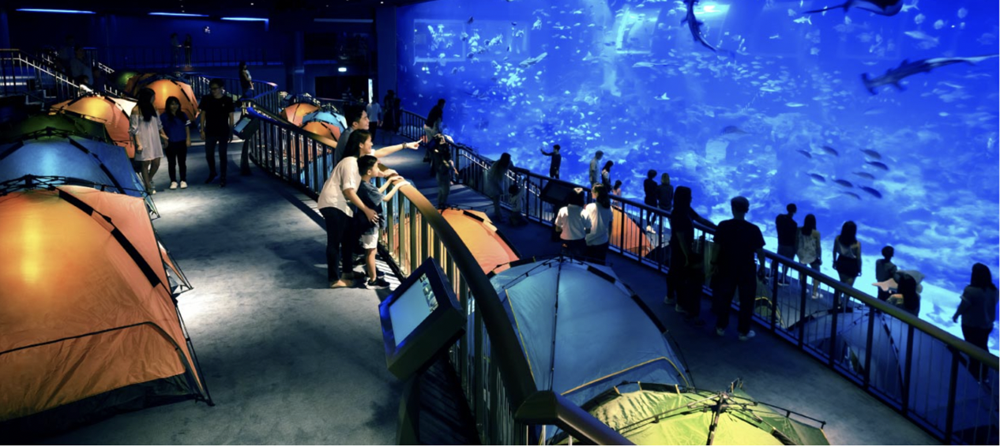

An enchanting sleepover at the Aquarium. As the day ends, night life begins under the sea! Witness nocturnal sharks becoming active, animals behaving in new ways, sea jellies communicating with one another and more. Drift into slumber as you camp in a tent at the Open Ocean Gallery with countless marine animals gliding by, and wake up to aquarists interacting with Manta Rays in a special feeding session. See the sea in a new light in this sleepover to remember! Indulge in an overnight immersive experience and go behind the scenes to explore the wonders of our blue planet.  

